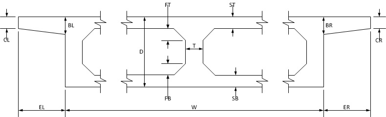
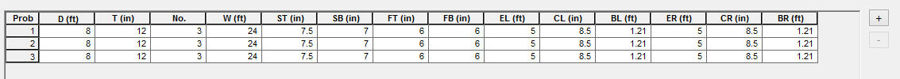

BoxGdr {#boxgdr}
=====================

BoxGdr computes the geometric section properties of a box girder including cross sectional area, moment of inertia, and centroid. 

Defining a Box Girder Section
------------------------------
A box girder section is defined by its characteristic dimensions as shown below.

The characteristic dimensions are entered into the input grid in the hupper half of the BoxGdr window.

Analysis Results
-----------------
The results of the section properties analysis are listed in the lower half of the BoxGdr window.

The results table lists the input dimensions and the following section properties:

Property | Description
---------|---------
I        | Moment of inertia about the horizontal centrodial axis
YT       | Location of neutral axis from top of girder section
YB       | Location of neutral axis from bottom of girder section
AREA     | Cross sectional area
WEIGHT   | Weight per unit length based on an assumed unit weight of 160 pcf
ZT       | Top section modulus
ZB       | Bottom section modulus
