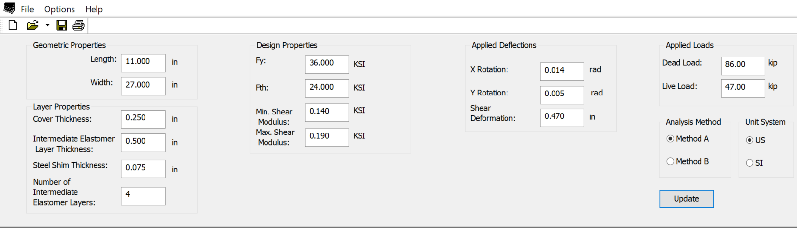

BrgCalc {#bearing}
=====================
BrgCalc (Bearing Calculator) designs the bearing pad for an rectangular elastomeric bearing per AASHTO LRFD specification.

## Defining the Bearing
The bearing geometric properties, loads, and boundary conditions are defined in the input window. Parameters are used in both Method A and Method B analysis.

## Design Report
The design report includes the complete calculations leading to the results of the design. References to the AASHTO LRFD specification are included.

