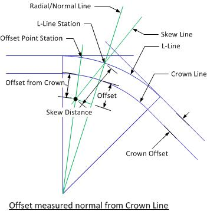

Curvel {#curvel}
============
Curvel computes roadway elevations, grade, and crown slope with respect to a given vertical curve and superelevation transition. Alignment information can be transferred between Curvel, PGSuper and PGSplice.

# Introduction
A Curvel project is started as described in [Creating BEToolbox Projects](@ref creating_projects). A wizard will guide you through the project definition process. 
The stationing for the project is carried on a survey line called the "L" Line. The profile grade is carried on the Profile Grade Line (PGL). The PGL does not have to be coincident with the "L" Line. 

<h2 id="Step1">Step 1 - Define Vertical Curve</h2>
The project definition begins with a vertical curve.

To define the vertical curve
1. Enter the entry grade, g1, and the exit grade, g2.
2. Enter the curve length
3. Enter the station and elevation of the Point of Vertical Intersection (PVI)
4. Press the [Next] button to continue

<h2 id="Step2">Step 2 - Define Roadway Section</h2>
Superelevation transitions can be included in the project definition.

1. Check the "Correct for superelevation or crown" box
2. Enter the offset from the crown point to the profile grade line
3. Enter the superelevation data
4. Press the [Next] button to continue

<h2 id="Step3">Step 3 - Define Results Locations</h2>
You specify the locations where elevations are computed. Elevations can be computed at individual station, at locations generated between two stations, and along skewed lines measured from the alignment.

The input for all three location definition methods is done with simple grids. Use the [+] and [-] buttons to add and remove rows from the grids.

### Individual Stations
Enter a series of individual stations where profile grade line elevations are to be computed.

### Station Range
Enter a series of starting and ending stations, along with the number of spaces between these stations, where profile grade elevations are to be computed.

As an example, if you wanted to compute profile grade elevation every 100 feet between station 0+00 and 5+00, enter 0+00 as the start station, 5+00 as the end station, and 4 spaces between the start and end.

### Skew Line
Elevations offset from the profile grade line can be computed with Skew Lines. Horizontal curves can be included in the skew line definitions.

To compute the elevation offset from the profile grade line:
1.	Enter the station where the skew line crosses the "L" Line
2.	Select the datum that describes how the offset is measured. The offset can be measured along a line that is normal to the "L" Line and measured from the crown line or along a line that is skewed with respect to the "L" Line and measured from the "L" Line. Refer to the figures below for details.
3.	Enter the offset
4.	Enter the skew angle of the line
5.	Enter the radius of the "L" Line (enter 0.0 if the "L" Line is straight)
6.	Enter the offset from the crown point to the "L" Line
7.	Press the [Finish] button

## Revising the Project Definition
The project definition can be revised by pressing the [Edit] button in the upper left corner of the main window. This will restart the input wizard at Step 1.

# Analysis Results
The results of the elevation analysis are shown below. The results consist of a listing of the input data followed by key parameters of the vertical curve and the profile grade elevation, profile grade slope, crown slopes, and elevation at the requested locations.

