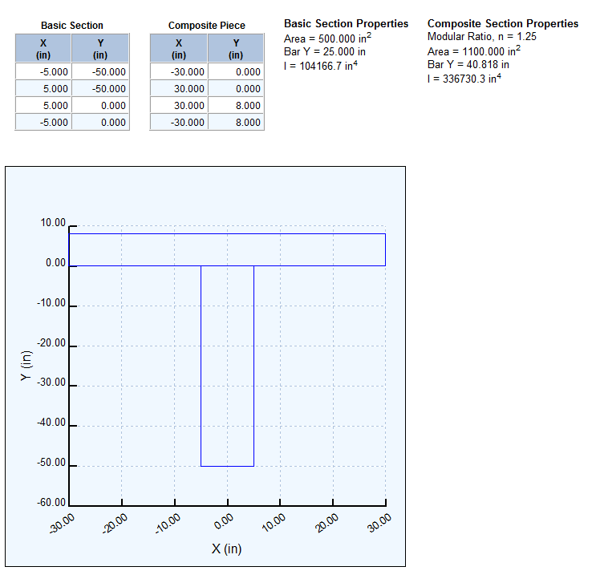

GenComp {#gencomp}
=====================
GenComp (General Composite Properties) computes the geometric section properties of a general composite cross section. The cross section is described by two composite parts. The parts are typically a girder with a composite deck, though they can be anything. The parts are defined by a series of Cartesian coordinates. 

Cross sections can be exported from PGSuper and PGSplice and subsequently imported into GenComp for further analysis and verification.

## Definining a General Composite Section
The general composite section is defined by the coordinates of the basic section and the composite piece and a modular ratio.

> The coordinates of the basic section and composite piece can be entered in either a clockwise or counter-clockwise direction around the perimeter of the part.

> Press the [Update] button while inputting coordinates to refresh the drawing of the cross section.

### Modular Ratio
The modular ratio is the ratio of the modulus of elasticity of the composite piece to the basic section. The modular ratio is used to transform the composite piece into a material that is equivalent to the material of the basic section.

### Basic Section
The basic section defines the main piece of the composite. Generally the basic section represents a girder. Using the basic section input grid, enter the coordinates that define the shape of the section.

### Composite Piece
The composite piece is a part that is added to the basic section. Generally the composite piece represents a bridge deck. Using the composite piece input grid, enter the coordinates that define the shape of the piece.

## Analysis Results
After entering the coordinates of the cross section pieces and the modular ratio, press the [Update] button to refresh the section properties.

The main window lists the input coordinates, the area, centroid (Bar Y), and moment of inertia (I) of the basic section and the composite section. The composite section is also displayed.

