GirComp {#gircomp}
=====================
GirComp computes the geometric section properties of built-up, rolled, or general steel section with a composite concrete slab.

## Definining a Composite Steel Girder
The composite steel girder section is comprised of a steel girder and a cast in place concrete deck. The steel girder can be modeled as a built-up plate girder, a rolled section, or a general section. Defining each of these girder section types is described below.

### Built-up Section
A built-up section consists of three rectangular steel plates; top flange, bottom flange, and web. The flange plates are defined by their width and thickness. The web plate is defined by its thickness and depth. 
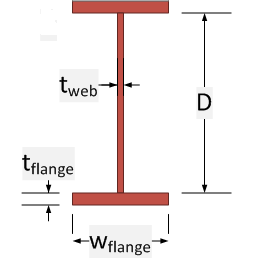

To define a built-up section
1. Select "Built-up" in the Type column of the input grid 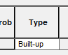
2. Enter the Web, Top Flange, and Bottom Flange dimensions in the input grid 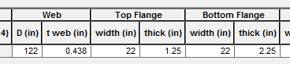

### Rolled Sections
A rolled section is a standard AISC W-shape. To define a rolled section
1. Select "Rolled" in the Type column of the input grid 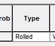
2. Select a shape from the Shape column of the input grid 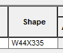

### General Sections
A general section does not have any specific shape. A general section is defined by its cross sectional area, moment of inertia, depth, and interface width with the deck slab.
To define a general section

1. Select "General" in the Type column in the input grid 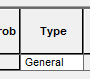
2. Enter the section properties of the shape 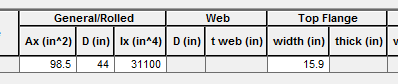

## Defining the Composite Slab
The composite slab is defined by its width, thickness, and the depth of the slab haunch. The width of the slab haunch is taken to be equal to the width of the top flange of the girder.
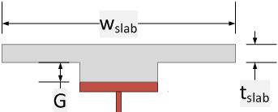

To define the composite slab
1. Define the girder shape as described above
2. Enter the slab dimensiosn in the input grid 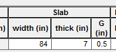

## Material Properties
The material properties are defined by the ratio of the slab and girder moduli of elasticity, also known as the modular ratio (N = Eslab/Egirder). Three modular ratios can be defined and transformed section properties are computed for each ratio.

The different modular ratios are used to simulate the age adjusted modulus of the slab concrete. 

> The age adjusted modulus is a convenient technique for modelling the effect of creep. The age adjusted modulus is computed as Eadj = E/(1+Y)

To input the modular ratios
1. Compute the desired modular ratios
2. Enter the modular ratios in the input grid 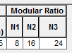

## Computing Section Properties
Press the [Update] button to cause the section properties to be computed.

The main window will list the section properties for the basic girder and the composite properties for each of the modular ratios.

The computed section properties are:

Property | Description
---------|---------------
I | Moment of Inertia
Ig | Moment of inertia of girder
Ic | Moment of inertia of composite section
Yt | Location of the centroid from the top of the girder section
Yb | Location of the centroid from the bottom of the girder section
St | Top section modulus
Sb | Bottom section modulus
Q Slab | First moment of area of the slab
Q Slab + Top Flange | First moment of area of the top flange and slab
Q Bot Flange | First moment of area of the bottom flange

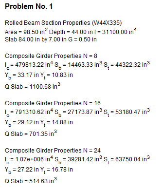
