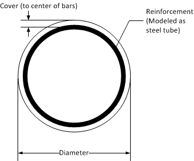
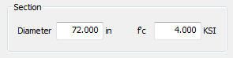
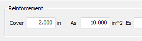
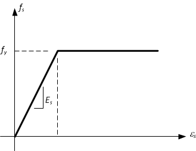
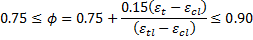
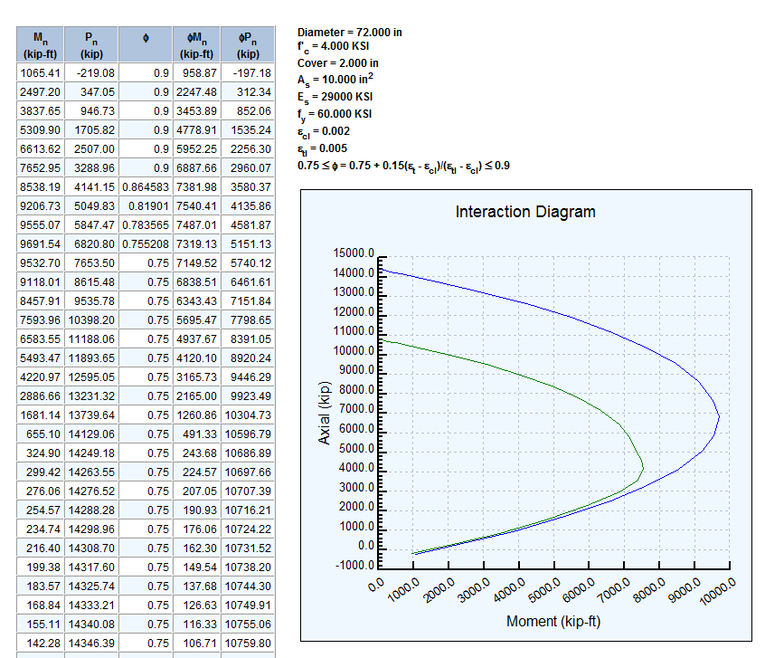

UltCol {#ultcol}
=====================
UltCol computes axial/bending interaction for a circular reinforced concrete column. The nominal moment capacity is computed for various levels of axial force between the compression and tension limits.

## Assumptions
UltCol uses a simplified solution for estimating the capacity of a circular reinforced concrete column. Engineering judgment must be used when determining the applicability of this software to a particular situation.
The following assumptions have been made:
* The ultimate concrete crushing strain is 0.003
* The reinforcing steel has a bi-linear, elastic-perfectly plastic stress-strain relationship
* The reinforcing steel is closely spaced and can be approximated with a thin steel tube

## Defining a Column Section
The column section is modeled as a circle with a steel tube.

### Section
Define the column section by entering its diameter and concrete strength.

### Reinforcement
The reinforcement is defined by its cover, area, and material properties.

The cover is defined as the distance from the face of the column to the center of the reinforcing ring. 

The area of reinforcement is the total area of all the reinforcing bars in the cross section. It is assumed that the bars are closely spaced and adequately modeled by a continuous ring of steel.

#### Reinforcement Material Properties
The material properties of the reinforcement consist of the modulus of elasticity, the yield strength and the compression controlled and tension controlled strain limits.

The modulus of elasticity (Es) and the yield strength (fy) are used to define the yield strain of the reinforcement. At the point of yielding, the reinforcement is assumed to be perfectly plastic.

The compression controlled (e cl) and tension controlled (e tl) strain limits are defined by AASHTO LRFD 5.7.2.1. These limits are used to compute the capacity reduction factor with AASHTO LRFD Equation 5.5.4.2.1-2. 

The capacity reduction factor is computed as

> Strain Limits per LRFD 5.7.2.1

<table>
<tr><td rowspan=2></td><td>Grade 60</td><td>Grade 60-100</td><td>Grade 100</td></tr>
<tr><td>0.002</td><td>Interpoloate</td><td>0.004</td></tr>
<tr><td rowspan=2></td><td>Grade 60-75</td><td>Grade 75-100</td><td>Grade 100</td></tr>
<tr><td>0.005</td><td>Interpoloate</td><td>0.008</td></tr>
</table>

## Analysis Results
Press the [Update] button to refresh the analysis results. The results consist of a tabular listing of the nominal moment and axial forces, the capacity reduction factor, and the moment and axial resistance. An interaction diagram is also created.

