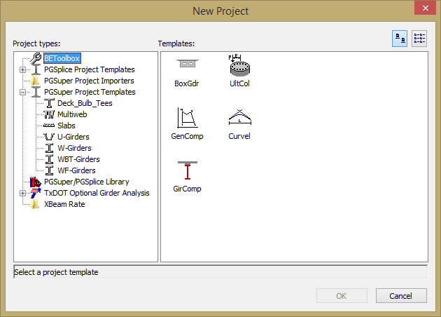

Creating BEToolbox Projects {#creating_projects}
=================
To create a new BEToolbox project:
1. Select *File > New*
2. Select the BEToolbox project type
3. Select one of the BEToolbox project templates 
4. Press the [OK] button to create the project.