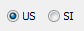

General Information {#general_information}
=================

Several of the BEToolbox applications use a common style of user interface. The interface is based on input grids.

## Input Grids
Many of the original BEToobox applications used input cards. Engineers would, using paper and pencil, fill out a deck of input cards and submit them to a data processing center for entry into a computer system. An example input card is shown in Figure 1.The concept of input cards is inherent in many of the modern BEToolbox projects however their modern equivalent is an input grid.

Each row of an input grid represents an input card. A row of data is known as a data set.

The grid rows are managed with two command buttons at the right of the grid. Use the [+] button to add a new data set. Use the mouse pointer to select the numerical row headers in the first column of the grid to select one or more data sets. Use the [-] button to remove a data set.

The columns in the grid represent the various elements of each data set. Use the mouse pointer to select a specific data element. The TAB and SHIFT+TAB keys can be used to move between data elements.

The input grids for several of the BEToolbox tools are wide. The grids, and related input controls and graphics, display best when the size of the main application window is maximized.

## Updating Results
Computation results will generally update whenever an input element is changed and the input cursor moves to another cell in the grid. Pressing ENTER or clicking the mouse pointer in a different cell will cause the results to update as well.

Press the [Update] button at any time to force the results to be recomputed.

## Units of Measure
Most of the BEToolbox tools work with both US and SI units. Select the US or SI option button to switch between unit systems. 
