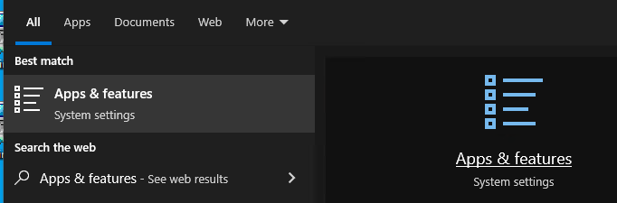
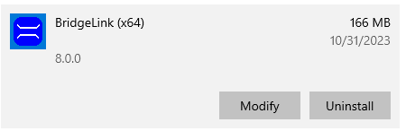
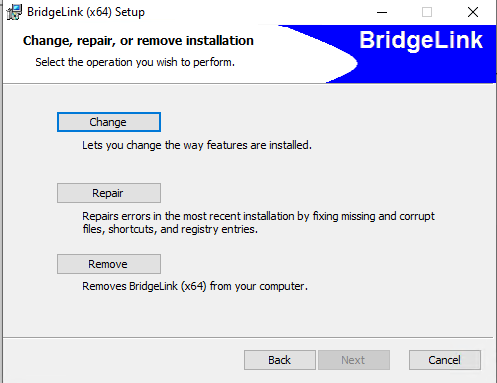

Installing Spectra {#installing_spectra}
=================
The Spectra tool for creating response spectra is an obsolete tool that is not longer used by WSDOT. This tool is not installed by default. The following section describes the steps to install the Spectra tool.

## Installing Spectra
1. In the Windows search bar, type in "Apps & features" and click on the "Apps & features" icon. 
2. Click on the BridgeLink (x64) app and press the Modify button. 
3. Select the Change option in the BridgeLink (x64) Setup program. 
4. Scroll down to the BEToolbox (Optional) select. Change the option for Specta to "Will be installed on local hard drive" 
5. Complete the installation setup

